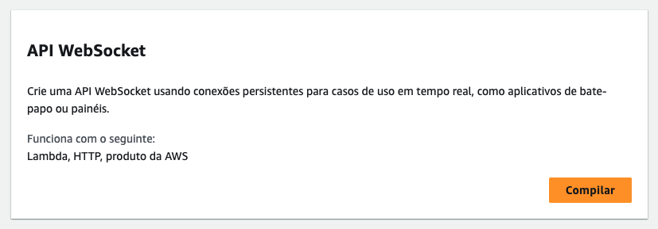
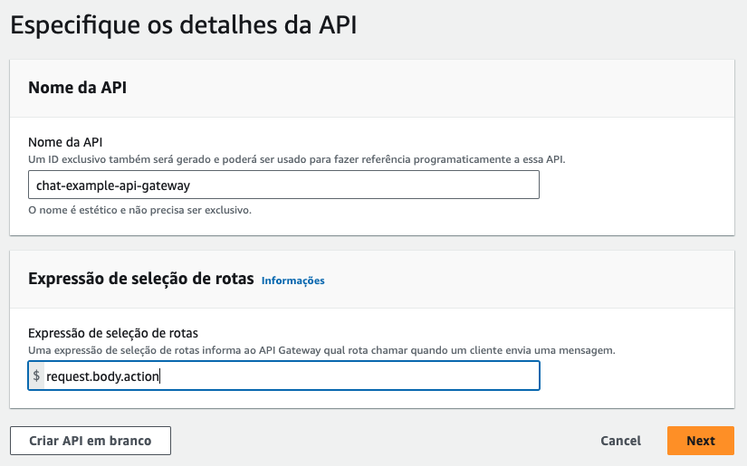
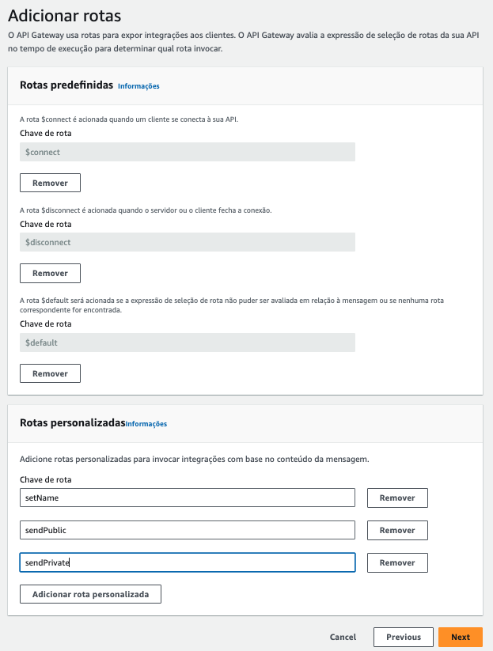
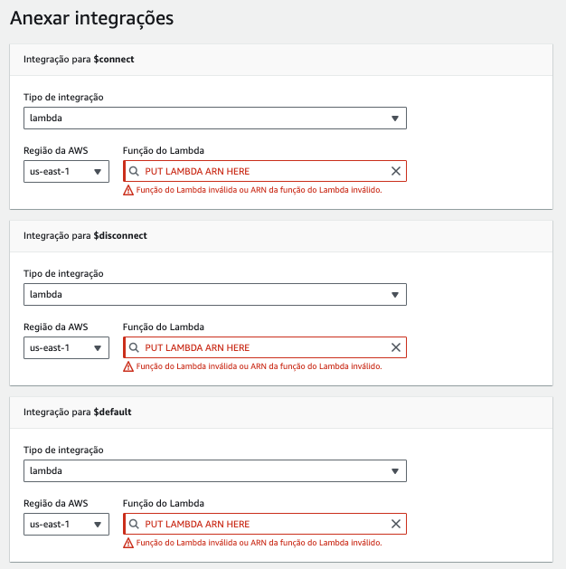
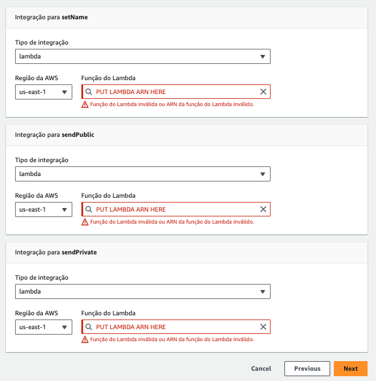
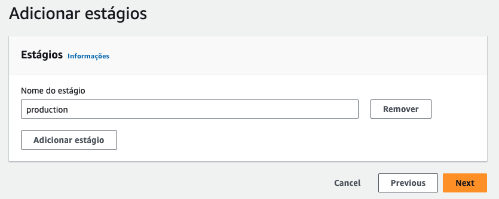

## Chat Websocket Real Time (Lambda | ApiGateway)

### Example

See this video!

<video width="100%" height="100%" controls>
  <source src="example.mp4" type="video/mp4">
</video>

### Config Lambda

Create a Lambda and set the code.

> Put the URL from `@connections URL` in action.js (remove https://)

```bash
URLWITHOUTHTTPS.com/STAGE/
```

> Attach policy to lambda policies (AmazonAPIGatewayInvokeFullAccess)

```bash
{
  "Version": "2012-10-17",
  "Statement": [
    {
      "Effect": "Allow",
      "Action": ["execute-api:Invoke", "execute-api:ManageConnections"],
      "Resource": "arn:aws:execute-api:*:*:*"
    }
  ]
}
```

---

### Config ApiGateway













---

### Config Frontend

> Put the URL from WSS in App.tsx (replace for WSS URL from ApiGateway)

```bash
wss://URLWSS.com/STAGE
```
